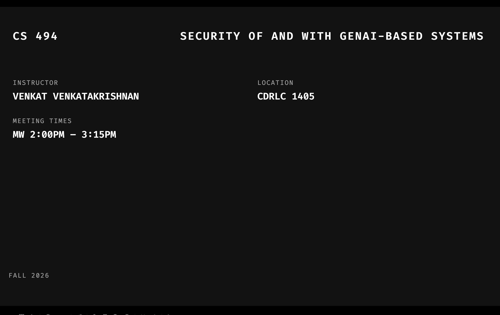

# Course-Site

This is the website for CS494: Security of and with GenAI Systems

# Course Information

# Course Overview

Generative AI is becoming transformative across the information technology industry and beyond. Current market forces and technological trends have forced enterprises to consider adopting digital transformation with GenAI. Members of the workforce have to contend with these changes and distinguish themselves in a world that is increasingly shaped by agentic systems. An important segment of the workforce is one that provides cybersecurity-related analysis and services. Their world has been no exception to this transformation, but the nature of the impact to their work is still being understood. This course will explore the topic of security of and with GenAI systems from the perspective of the future workforce. 

# Learning Objectives

Upon completion of the course, students will be able to:
* Demonstrate a practical understanding of security attacks on GenAI-based systems
* Analyze the security of systems that incorporate GenAI-based components
* Design defensive architectures for GenAI-based systems
* Evaluate the use of GenAI-based tools for systems and software vulnerability analysis

# Textbook

No required textbook. Materials used in class  will be based will be made available on this page.

Reference books:

Securing AI Agents: Foundations, Frameworks, and Real-World Deployment - Ken Huang and Chris Hughes (Springer, 2026). 

* Available as a free e-book from UIC Library.

# Grading

 * 30% for homework assignments (3-4 assignments in all)
 * 25% for class project
 * 15% for class participation
 * 30% for exam

# Lectures
	
|Date |  Lecture Number and Topic | Slides                  |
|-----|-----------------|----------------------------|
|24 Aug 26 | 1. Lecture 1 -  Welcome | [Slides](slides/lec01.pdf) |
|26 Aug 26 | 2. Lecture 2 -  Security Goals | [Slides](slides/lec02.pdf) |

# Generative AI Policy

Use of Generative AI tools is encouraged *except* when the guidance explicitly discourages it. Students are encouraged to experiment with, analyze, and understand the use and impact of GenAI tools. While these tools are great, the suggested mode of use and interaction is one that involves a considerable level of *caution and skepticism* when it comes to matters of correctness, security and trust, and adequate safeguards, as discussed in class, to be taken with the adoption of tools.

# Acceptable Computer Use Policy of UIC
[Acceptable Use Policy](https://policies.uic.edu/uic-policy-library/information-technology/acceptable-use-of-computational-resources/)

# Disability Accomodations Statement

UIC is committed to full inclusion and participation of people with disabilities. If you have a disability and need accommodations, please contact the Disability Resource Center (DRC) at drc@uic.edu or (312) 413-2183 to-get a Letter of Accommodation (LOA). Please share this letter with me early in the term so we can discuss your needs.

